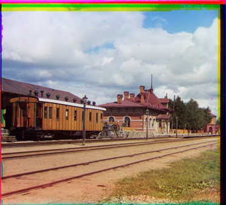

# 🎨 Colors of the Past: Prokudin-Gorskii Restoration

This project focuses on aligning and restoring the three-channel (Blue, Green, Red) glass plate negatives taken by Sergei Mikhailovich Prokudin-Gorskii in the early 20th century, implemented from scratch using the **NumPy** library. The project **does not** use built-in alignment functions such as `cv2.matchTemplate` or similar.


---

## 🎯 Applied Techniques and Report View

The project is designed as a multi-step image processing **pipeline**. All steps are demonstrated using the `1.jpg` image.

### 1. Image Splitting and Raw State
The long input `.jpg` file is split into three equal parts (Blue, Green, Red channels) using **NumPy array slicing**. This represents the raw state of the channels before alignment.


### 2. Channel Alignment (SSD & NCC)
Taking the Blue channel as the reference (fixed), the optimal **`(dx, dy)` shift vectors** for the Green and Red channels relative to the Blue channel were found. Two different metrics were coded from scratch for this operation:
* **SSD (Sum of Squared Differences):** Fast, but sensitive to brightness changes.
* **NCC (Normalized Cross-Correlation):** Slow, but robust against brightness changes.


### 3. Image Enhancement
Three different techniques were applied to improve the quality of the aligned image and revitalize the dark structure characteristic of historical photographs:
1.  **Gamma Correction:** Dark areas were brightened using the formula `output = 255 * (input / 255)^gamma` (The most successful result).
2.  **Histogram Equalization:** The global contrast of the image was increased.
3.  **Laplacian Filtering:** Edges were sharpened to emphasize details.



### 4. Bonus: Pyramid-Based Speedup
A pyramid-based (multi-scale) alignment method was implemented to overcome the slowdown experienced in high-resolution (`.tif`) files within large search windows (e.g., `[-100, 100]`). This method reduced the computation time from `~5-6` seconds to `~0.4` seconds.

### 5. Bonus: Automatic Border Cropping
The distorted frames (borders) that appear at the edges of the channels after the alignment process were automatically detected and cropped by analyzing the **standard deviation of the pixels**.

---

## 🚀 Setup and Running

1.  Make sure the necessary libraries are installed:
    ```bash
    pip install numpy matplotlib opencv-python
    ```
2.  Clone the project files and ensure the images are in the `resimler` (images) folder.
3.  Run the script with the following command (assuming your script name is `proje.py`):
    ```bash
    python proje.py --input resimler/1.jpg
    ```
4.  The script will save all visual outputs to the `sonuclar/` (results) folder.

---

## 👤 Project Owner
Artificial Intelligence Engineering Student

* **Gülnaz Aydemir**
* Ostim Technical University
